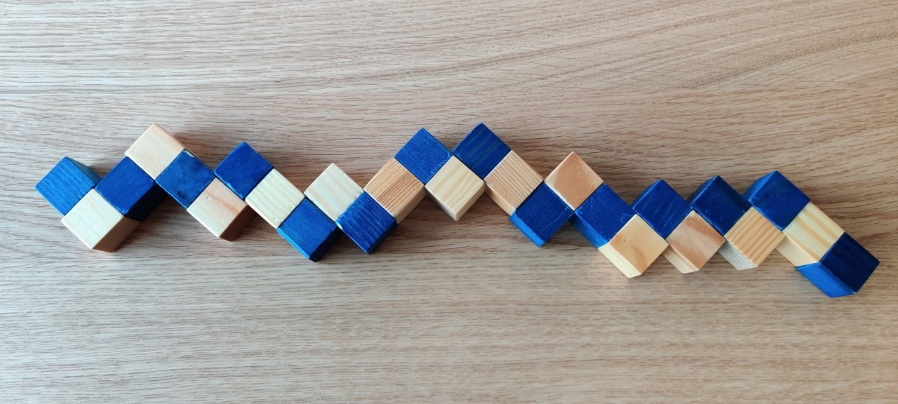
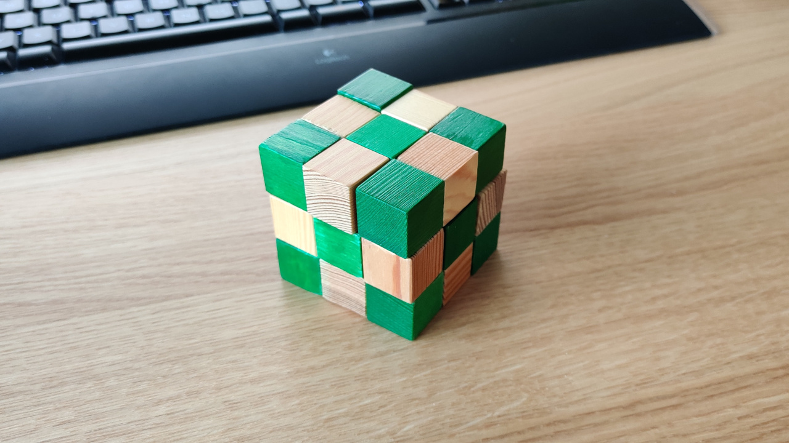
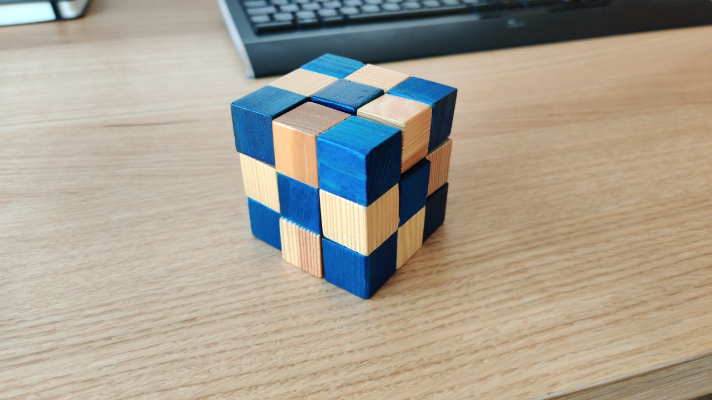

# Snake cube solver

This is a short Jupyter notebook in Python 3 that solves 3x3x3 snake cube puzzles.

I wrote it because I was too impatient to solve a snake cube I had lying around, and yet wanted to store the thing in the most space efficient way - so it had to become a proper cube.

The program takes a simple encoding of a snake:

 

And generates instructions how to turn it into a cube:

 

## Requirement~s~:
- numpy, any version will do

## License

Distributed under the terms of the GNU GPLv3 License (see [LICENSE](LICENSE)).
